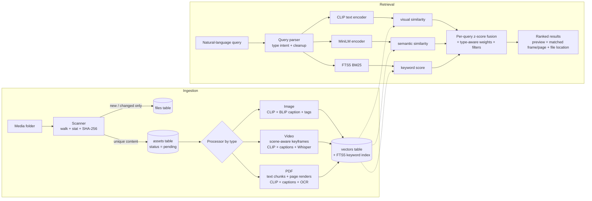

# AssetLens: AI-powered Digital Asset Management

AssetLens indexes a local folder of **images, videos and PDF brochures** and lets you find assets by describing them in plain English, e.g. *"a woman standing with a cat"*, *"videos containing construction activity"* or *"brochures related to residential projects"*.

Search uses the **actual content** of each file:

- **Pixels** (CLIP embeddings of images, video keyframes and PDF pages).
- **AI-generated captions** (BLIP).
- **Speech** in videos (Whisper).
- **Document text** (PDF text layer, plus OCR when Tesseract is installed).

Filenames are only a very weak keyword signal. The dataset downloader even gives files neutral names (`pixabay_img_123.jpg`) so the search cannot cheat.

Everything runs **locally on a CPU laptop**, with only free and open-source models. No paid APIs, no cloud.

**Demo video:** _(link added at submission)_

---

## 1. Quick start

Tested on Windows 11 (i5-1235U, 8 GB RAM, no GPU) with Python 3.11. It also works on macOS and Linux.

```bash
# 1. create an environment (Anaconda / Miniconda)
conda create -n assetlens python=3.11 -y
conda activate assetlens

# 2. install dependencies (CPU-only PyTorch is the default on Windows/macOS)
pip install -r requirements.txt

# 3. configuration
copy .env.example .env        # Windows   (macOS/Linux: cp .env.example .env)
#    -> open .env, set PIXABAY_API_KEY (free: https://pixabay.com/api/docs/)
#    -> MEDIA_DIR is the folder that will be indexed (default ./media)

# 4. download a public dataset into MEDIA_DIR (or point MEDIA_DIR at your own files)
python scripts/download_dataset.py --target-gb 3

# 5. start the app, then click "Start / resume indexing" in the Indexing tab
python -m dam serve
#    -> open http://127.0.0.1:8000
```

Instead of the UI, you can index from the terminal. It shows progress and ETA, and Ctrl+C is safe:

```bash
python -m dam index              # full pipeline
python -m dam index --fast       # no captions / speech-to-text, about 4x faster, lower quality
python -m dam search "videos containing construction activity"
python -m dam stats              # writes docs/DATASET.md
python -m dam failures           # lists failed / unsupported files
pytest -q                        # 11 end-to-end tests, no model download needed
```

On the first run, the models are downloaded once from Hugging Face (about 1.3 GB in total) and cached.

---

## 2. Architecture and data flow



| Layer | Choice | Why |
|---|---|---|
| Backend | **FastAPI** (Python) | The ML ecosystem is in Python; async server, auto-docs at `/docs` |
| Frontend | Plain HTML/CSS/JS served by FastAPI | No build step, runs anywhere, easy to read |
| Database | **SQLite** (WAL mode) | Zero setup, a single file, transactional, survives crashes |
| Vector search | NumPy brute-force cosine over vectors stored in SQLite | Under 10 ms for ~50k vectors; no extra service to install. See §7 for scaling |
| Keyword search | SQLite **FTS5** (BM25, Porter stemming) | Exact terms such as project names or "RERA" in brochures |
| Visual embeddings | **OpenCLIP ViT-B/32 (LAION-2B)** | Puts text and images in one space, so text can match pixels directly; fast on CPU |
| Captions | **BLIP-base** | Human-readable description, extra semantic text signal, explains results |
| Text embeddings | **all-MiniLM-L6-v2** | Small (90 MB), fast, good sentence similarity |
| Speech | **faster-whisper tiny (int8)** | Testimonial/interview videos are about *what is said* |
| OCR | Tesseract (optional) | Scanned brochures without a text layer |

### Main tables (`dam/db.py`)

- **`files`**: one row per *path*. Stores filename, folder, extension, type, size, mtime, SHA-256 hash, status (`ok`, `unsupported`, `too_large`, `unreadable`) and `present`.
- **`assets`**: one row per *unique content* (hash). Stores processing status (`pending`, `processing`, `done`, `failed`), error, attempts, model signature, caption, tags, body (PDF text / transcript), metadata JSON, warnings and timing.
- **`vectors`**: many rows per asset. Each row has a `space` (`clip` or `text`), a `source` (`image`, `frame`, `page`, `caption`, `transcript`, `pdf_text`, `pdf_summary`) and a `ref`, the **timestamp or page number**. That's how the UI can say *"matched at 0:35"* or *"page 4"*.
- **`assets_fts`**: FTS5 keyword index. **`jobs`**: indexing runs and live progress. **`judgments`**: evaluation labels.

Separating *content* (`assets`) from *location* (`files`) is the key design decision. It gives de-duplication, renames and moves without re-processing, and "identical copies" in the UI.

---

## 3. How each media type is understood

### Images

The pipeline is decode → verify → EXIF-rotate → downscale to 768 px, then:

1. A **CLIP image embedding**.
2. A **BLIP caption**, also embedded with MiniLM.
3. **Zero-shot CLIP tags** from a ~90-concept vocabulary (shown as chips and added to keyword search).

Width, height and format are stored for the orientation filter.

### Videos: why not every frame

A 30-second clip at 30 fps has 900 nearly identical frames, so processing all of them wastes CPU and adds no information. AssetLens does this instead (`processors.sample_keyframes`):

1. **Candidates:** about 1 frame per second, at most ~150 per video, so long videos stay cheap.
2. **Scene-aware selection:** a candidate is kept if its colour histogram differs from the last kept frame (Bhattacharyya distance > 0.35, i.e. a new scene) **or** 4 s have passed. Near-black fade frames are skipped.
3. **Cap:** at most 16 keyframes, spread evenly.
4. Every keyframe gets a **CLIP embedding**. Six evenly spread keyframes get **BLIP captions**, since captioning is the slow step on CPU.
5. **Audio:** the first 3 minutes are transcribed with Whisper (with voice-activity detection) and chunked into text vectors. That's what makes *"customer testimonial videos"* work even when the frames look like any other person.
6. **Scoring:** a video's visual score is its **best-matching keyframe**, and the UI opens the player **at that timestamp**.

Videos are sequentially grabbed instead of seeked, because seeking in webm/mkv is unreliable. Videos above ~16 minutes switch to time-based seeking.

### PDFs / brochures

- **Text:** the text layer of up to 60 pages, split into ~900-character chunks, each remembering its page. Scanned pages with no text use OCR when Tesseract is available.
- **Visual:** the first 6 pages are rendered to images, then CLIP-embedded and captioned. Brochures are mostly photos, and a floor-plan page can match *"apartment floor plan"* even without text.
- **Summary vector:** title plus the first 600 characters. It works well for *"brochures about X"* queries.
- **Ranking:** the result shows the matched **page**, and the PDF preview opens on that page.

---

## 4. Search and ranking (`dam/search.py`)

1. **Query parsing.** Type words are detected and removed before embedding: *"Videos containing construction activity"* becomes type `video`, embedded text *"construction activity"*. The type gets a soft boost (+1.0), not a hard filter, so a great image can still appear.
2. **Three signals per asset:**
   - **visual:** max cosine between the CLIP text query and the asset's image / frame / page vectors.
   - **semantic:** max cosine between MiniLM(query) and the asset's caption / transcript / PDF text vectors.
   - **keyword:** FTS5 BM25 over captions, tags, transcripts and PDF text. Filenames get a very low weight.
3. **Calibration.** CLIP scores sit around 0.15–0.35 and MiniLM scores around 0.1–0.8, so adding them raw would let one model dominate. Each signal is converted to a **z-score across the whole collection for that query**, which makes them comparable without hand-tuned thresholds.
4. **Type-aware weights.** Images use visual 0.60 + semantic 0.40. Videos use 0.55 + 0.45. PDFs use 0.25 + 0.75, because text matters more in documents. Keyword adds up to 0.35.
5. **Output.** A relevance %, a confidence level (high / medium / low; low results are dimmed), and an explanation of **why** it matched (which frame, page, caption or transcript snippet).
6. **Filters:**
   - Type, size range, folder, modified date.
   - Orientation (landscape / portrait / square).
   - Video max duration and "has speech".
   - Empty query = browse the newest assets.
7. **Duplicates.** Identical files appear once, with a "+1 copy" badge and all locations in the preview.

---

## 5. Reliability and incremental indexing

| Requirement | How it's handled | Code |
|---|---|---|
| **Re-run without re-processing** | Path + size + mtime unchanged → no re-hash, no AI work. New or changed files only. | `Indexer.scan` |
| **Duplicate files in different folders** | SHA-256 content hash; one `assets` row and multiple `files` rows. Processed once. | `Indexer.scan` |
| **Large folders / long runs** | Iterative directory walk; each file is committed in its own transaction; live progress + ETA in UI and CLI; runs in a background thread; Stop button. Images are processed first, so search is usable early. | `Indexer.run`, `IndexManager` |
| **Crash / power cut / Ctrl+C** | Finished files are already saved. On the next start, anything stuck in `processing` goes back to `pending`, so the run **resumes**. | `Indexer.run` |
| **Corrupted files** | Verified on decode (truncated JPEG, broken MP4, garbage PDF, encrypted PDF, 0-byte files). Marked `failed` with a clear reason and **not retried until the file changes**. | `processors.py` |
| **Unsupported files** | Recorded with status `unsupported` and reason, shown in the UI, never hashed or processed. | `Indexer.scan` |
| **AI / model failure** | Core models are loaded *before* processing. If one can't load (e.g. no internet on first run), the job stops with a clear message and **nothing is marked failed**. A failing optional model (captioner, Whisper, OCR) only adds a **warning**; the asset is still indexed with the other signals. Unexpected errors are retried on later runs (up to `MAX_ATTEMPTS`). | `models.py`, `processors._caption_safely` |
| **Deleted / moved files** | Missing files are marked `present=0` and hidden from search. A moved file keeps its AI results (same hash). | `Indexer.scan` |
| **Model upgrades** | A model signature is stored per asset. Changing a model in `.env` re-processes assets automatically. | `Settings.model_signature` |
| **Persistence** | Everything is in `data/dam.sqlite3` plus `data/thumbs/`. A server restart keeps the index. | `db.py` |

All of this is covered by automated tests in `tests/`: incremental re-runs, a changed file, a new file, duplicates, corrupt image/video, unsupported type, caption-model crash, model-load failure, crash recovery, deleted files, filters, video timestamps and API flows.

---

## 6. Dataset

See **[docs/DATASET.md](docs/DATASET.md)**, generated by `python -m dam stats` from the real index.

`scripts/download_dataset.py` builds it automatically:

- **Images and videos:** Pixabay API (Pixabay Content License), with Wikimedia Commons as a no-key fallback. About 30 image topics and 24 video topics chosen to cover the example queries (people with pets, interiors, construction, offices/meetings, talking-to-camera, cities, food, nature).
- **PDFs:** real public documents and brochures from Wikimedia Commons. Plus **10 generated sample brochures** (residential, commercial, construction, tourism, food, pets) built from the downloaded photos, because truly public residential-project brochures are rare. Every third brochure is rasterised to simulate a **scanned PDF with no text layer**. These are clearly marked as generated in `data/dataset_manifest.csv`.
- **Test cases** in `media/misc_uploads/`: duplicate copies of real files, a truncated JPEG, a random-bytes MP4, a broken PDF, an empty PNG, and `.txt` / `.xlsx` / `.zip` files.

**Size limitation:** the dataset is ~3 GB, not 5–10 GB. On an 8 GB-RAM CPU-only laptop, full-quality indexing runs at about 1.5 s per image and 15–25 s per video, so 3 GB fits into a few hours. The design does not depend on size:

- Indexing is incremental and resumable, so 10 GB is just a longer (or multi-session) run.
- Per-file memory is bounded (frames are downscaled, at most 16 per video; PDFs at most 60 pages of text and 6 renders).
- Search cost grows linearly with the number of vectors.

§7 explains what changes at 100k+ files.

---

## 7. Evaluation

See **[eval/RESULTS.md](eval/RESULTS.md)**. The 14 test queries are in `eval/queries.json`.

How quality was checked:

1. Each query states **what the user is trying to find** and **which assets are expected**. The expected assets were taken from the download manifest (the topic each file was fetched for), then confirmed visually.
2. In the **Evaluate** tab every query is run, and each top-5 result is marked ✓ or ✗ by looking at it. Judgments are stored in SQLite.
3. Metrics:
   - **Precision@5**
   - **MRR** (how soon the first good result appears)
   - **Hit-rate@5**
   - **Recall@10** against all assets judged relevant
4. Failure cases are written down per query (e.g. counting, colour attributes, abstract concepts such as "testimonial" without speech).
5. Ranking weights were tuned once on these results; before/after numbers are in RESULTS.md.

---

## 8. Known limitations and production improvements

| Limitation now | Production approach |
|---|---|
| Brute-force vector search loads all vectors into RAM (fine up to ~200k vectors) | FAISS/HNSW or Qdrant / pgvector with metadata filtering; shard by collection |
| One indexing worker (CPU-bound models, 8 GB RAM) | Job queue (Celery/RQ/Arq) with separate decode and GPU inference workers; batched inference; ONNX/OpenVINO for 2–3× CPU speed-up |
| CLIP ViT-B/32 is weak at counting, small objects, fine attributes (colour of a specific object), text in images | Larger CLIP/SigLIP model on GPU; re-rank the top-50 with a vision-language model (e.g. Florence-2 / Qwen-VL); OCR on images |
| Whisper `tiny` makes mistakes on accents/noise; only the first 3 min are transcribed | `small`/`medium` on GPU, full-length audio, speaker diarisation |
| Fusion weights are hand-set (z-score fusion + small tuning on 14 queries) | Larger labelled query set, learning-to-rank, click feedback |
| Keyframes chosen by colour histograms | Shot-boundary detection (TransNetV2), action recognition for motion-based queries ("people running") |
| PDF: first 60 pages of text, 6 page renders | Full parsing, embedded-image extraction, layout-aware chunking, table extraction |
| Local single-user app, no auth (as required) | Auth/RBAC, multi-tenant storage (S3), file watcher / event-driven ingestion, audit logs |
| Hash computed on every new/changed file (I/O bound for huge videos) | Partial hashing (size + first/last MB) as a pre-filter, full hash in the background |

---

## 9. Project structure

```
dam/
  config.py       settings from .env (models, sampling, limits)
  db.py           SQLite schema + persistence helpers
  models.py       lazy-loaded CLIP / BLIP / MiniLM / Whisper / OCR (+ FakeModels for tests)
  processors.py   image, video (keyframe sampling), PDF processors
  indexer.py      scan → hash → dedupe → process; resume, retries, progress
  search.py       query parsing, vector index, hybrid z-score fusion, filters
  evaluation.py   test-query runner, judgments, metrics, RESULTS.md export
  app.py          FastAPI routes (search, preview, file serving, indexing, eval)
  static/         web UI (index.html, app.js, style.css)
scripts/download_dataset.py   public dataset builder (Pixabay + Wikimedia + test cases)
eval/queries.json             14 test searches
tests/                        end-to-end tests with fake models
```

### API

| Method | Path | Purpose |
|---|---|---|
| GET | `/api/search?q=&kinds=&min_mb=&max_mb=&folder=&orientation=&max_duration=&has_speech=&top_k=` | Ranked search |
| GET | `/api/assets/{hash}` | Full details: all locations, keyframes/pages, transcript, warnings |
| GET | `/api/file/{id}` | Original file (range requests, so videos can seek) |
| POST | `/api/open/{id}` | Reveal the file in Explorer / Finder |
| POST | `/api/index/start` · `/api/index/stop` | Run / stop indexing |
| GET | `/api/index/status` · `/api/stats` · `/api/failures` | Progress, library stats, problems |
| POST | `/api/retry-failed` | Re-queue failed assets |
| GET/POST | `/api/eval`, `/api/eval/judge`, `/api/eval/export` | Evaluation workflow |

Interactive API docs are at `http://127.0.0.1:8000/docs`.
